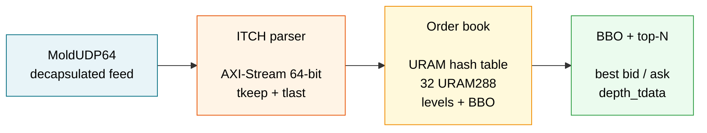

# FPGA Quant Pipeline

A **low-latency market-data pipeline for AMD/Xilinx UltraScale+**: a Nasdaq
TotalView-ITCH 5.0 parser and a URAM-backed order book with BBO / top-N output,
plus a CME MDP3/SBE parser — all in SystemVerilog, verified **bit-exactly**
against an independent Python golden model.

The RTL starts at the already-decapsulated MoldUDP64 payload; the 10G MAC and
Ethernet/IP/UDP layers are intentionally out of scope.



```
                 +----------------+      +-----------------+      +------------------+
MoldUDP64 -----> |  ITCH parser   | ---> |   Order book    | ---> |   BBO / top-N    |
(decapsulated)   | itch_parser.sv |      | orderbook.sv    |      | bbo_tdata +      |
                 | AXI-Stream 64b |      | URAM hash table |      | depth_tdata      |
                 | tkeep + tlast  |      | 32 URAM288      |      |                  |
                 +----------------+      +-----------------+      +------------------+
```

## Verified numbers

| Metric | Value |
|---|---|
| Latency wire→BBO (DW=32, mean) | **65.5 cycles = 203.3 ns** @ 322.265625 MHz |
| Real-feed BBO events (bit-exact) | **17,484** (cross=0, anomaly=0, gaps=0) |
| Timing closure | **156.25 MHz / 10G** — WNS **+0.057 ns**, TNS 0, DRC 0 |
| Order table | **32 URAM288** (8.52 Mbit), 65,536 slots |
| Golden model throughput | 268.7M messages in 17 min, 0 anomalies |
| Verified against | independent Python golden model, bit-exact |

## Project status

| Stage | Scope | Status |
|---|---|---|
| **Golden model** | Python ITCH parser + order book + vectors | ✅ closed (22 types, real-day replay) |
| **ITCH parser RTL** | `s_axis_tkeep` framing, gaps, backpressure | ✅ closed (91/91 `tlast`, line-rate REP-02) |
| **Order book RTL** | URAM table, BBO, atomic replace | ✅ closed (bit-exact real replay) |
| **DW=32 / URAM** | top-N, end-to-end chain | ✅ functional end-to-end; **156 MHz/10G closed**; **322 MHz open** (I/O-bound) |
| **CME MDP3 parser** | SBE framing + schema gate | ✅ functional (14/14 ×2); **timing open** (does not fit the part) |

The 322 MHz variant is **not** presented as closed. Its internal datapath closes
after splitting the `m_loc_idx → sm_asel` timing path, but the residual WNS is
dominated by the output I/O of the `-2L` speed grade (source clock delay + OBUF
exceed the 3.103 ns period). The 156.25 MHz / 10G variant is the closed,
evidence-backed claim. Full detail: [`ARCHITECTURE.md`](ARCHITECTURE.md).

## Why it is non-trivial

The order book resolves, without an escape FIFO:

- **RAW hazards** between consecutive messages on the same order/level.
- **Atomic `U` replace** (delete + add as a single state, never a gap in the BBO).
- **URAM with 1 write/cycle and a registered read** — the table is 32 URAM288
  primitives with serialized writes and a 1-cycle read pipeline.

Every invariant is *signaled* (`error`, `anomaly_count`, `cross_events`) — never
silent.

## Quick start

```bash
# 1. Full Python golden-model regression (ITCH + CME)
python3 -m unittest discover -s golden_model/tests -t .

# 2. Download one sample day from emi.nasdaq.com (md5-verified, fail-closed)
python3 scripts/fetch_itch.py 12302019.NASDAQ_ITCH50.gz

# 3. Golden-model run: stats + BBO vectors for the subset
python3 -m golden_model.scripts.run_golden \
    data/itch_sample/12302019.NASDAQ_ITCH50.gz \
    --subset verification/vectors/subset_symbols.json \
    --out data/itch_sample/out --text

# 4. BinaryFILE -> MoldUDP64 pcap for the RTL testbenches
python3 scripts/binaryfile_to_pcap.py in.ITCH50 out.pcap

# 5. RTL verification (cocotb + Verilator)
make -C verification/testbenches/parser   sim
make -C verification/testbenches/orderbook sim
make -C verification/testbenches/phase3   sim          # parser->book chain
make -C verification/testbenches/phase3   sim-lat      # wire->BBO latency
make -C verification/testbenches/uram     sim-uram
make -C verification/testbenches/mdp3     sim

# 6. Vivado synthesis + implementation (fails on negative slack)
vivado -mode batch -source synth/fase3_156mhz.tcl   # 156.25 MHz -> reports/156mhz/
vivado -mode batch -source synth/fase3_synth.tcl    # 322 MHz    -> reports/322mhz/
```

Requirements: Python 3.10+ (stdlib only for the golden model); Verilator +
cocotb for the RTL testbenches; Vivado ML for synthesis in Vivado ML Standard.

## Repository layout

```
.
├── rtl/                 SystemVerilog: ITCH/MDP3 parsers, order book, chain
├── golden_model/        Independent Python reference (parser + book + vectors)
├── verification/        cocotb testbenches + synthetic vectors + latency JSON
├── synth/               Vivado tcl + constraints + timing/utilization reports
├── scripts/             Data tooling (download, md5 check, BinaryFILE -> pcap)
├── ARCHITECTURE.md      Design detail: hazards, latency, timing, honest limits
└── README.md
```

Real market data is never committed (`data/**` is gitignored); replay evidence
requires local, non-versioned artifacts.
